# 📃 SecurityNote
**spring-security** 와 **thymeleaf** 뷰 구현 연습을 위한   
🙅‍♀️비밀노트입니다.

# class 정보
### 💛 member Package
유저,관리자 회원가입, 정보를 저장하는 package

자세히 보기

- UserEntity: db 에 접근할 수 있는 user 정보
- UserDto: view 에 전달할 user 정보 (회원가입용)   
- UserRepository: db 에서 user 데이터를 꺼내옴   
- UserController: 회원가입 control
- AdminController: 모든 유저의 노트 조회_어드민이 접근할 수 있는 노트 조회 package (user 는 못봄)
- UserService: 회원가입 메소드 구현(유저, 관리자)
  - passwordEncoder 를 사용하기 위해서는 Bean 을 주입받아야 한다.(configPackage)   

  
- AlreadyRegisteredUserException: 이미 있는 유저인 경우 exception
- UserNotFoundException: 유저를 찾을 수 없을 때 exception

### 💛 note Package
유저가 작성할 수 있는 노트 package (admin 도 보기 가능)

자세히 보기

- NoteEntity: db 에 접근할 수 있는 note 정보
- NoteDto: view 에 전달할 note 정보
- NoteRepository: db 에서 note 데이터를 꺼내옴(조회, 삭제를 위함)
- NoteController: note 조회, 생성, 삭제 
- NoteService: note 조회, 생성, 삭제 메소드 구현

### 💛 noticePackage

관리자가 작성할 수 있는 공지 package (user 는 볼 수 없음)

자세히 보기

- NoticeEntity: db 에 접근할 수 있는 공지 정보
- NoticeRepository
- NoticeController: 공지 조회, 생성, 삭제
- NoticeService: 공지 조회, 생성, 삭제 메소드 구현

### 💛 config package

자세히 보기

인증, 인가를 구현하는 package
- passwordEncoderConfig: 비번 암호화 config
  - passwordEncoder 를 사용하기 위해서는 Bean 을 주입받아야 한다.(configPackage)
- JpaAuditorConfig: JPA 에서 시간을 자동으로 값을 넣어주는 기능
- MvcConfig: view 페이지 설정 (url => html )
- SpringSecurityConfig: security 설정
- InitializeDefaultConfig: default 데이터 설정

# 🙍‍♂️ default 계정 정보

- user
  - 아이디: user 
  - 비밀번호: user
- admin
  - 아이디: admin 
  - 비밀번호: admin

# 🔎 view 정보

# main page

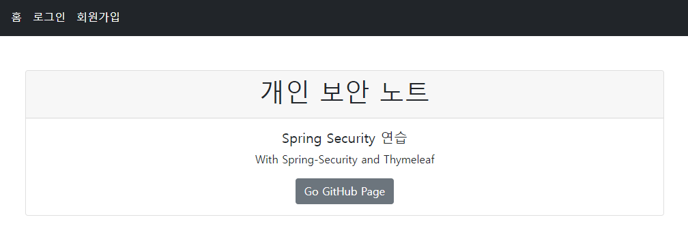

비밀 노트의 메인 페이지 입니다.

### all nav

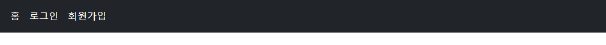

모든 사람에게 보이는 nav 바 입니다.   

### user nav

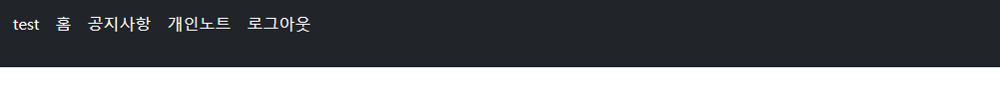

로그인한 유저에게 보이는 nav 바 입니다.

### admin nav

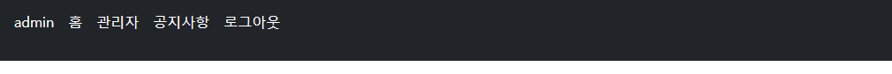

관리자에게 보이는 nav 바 입니다.

# sign up page

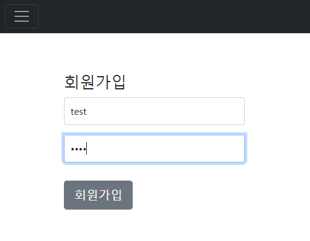

회원가입 페이지 입니다.   
아이디와 비밀번호를 입력 후, 회원가입 버튼을 누르면   
로그인 페이지로 redirect 됩니다.

# login page

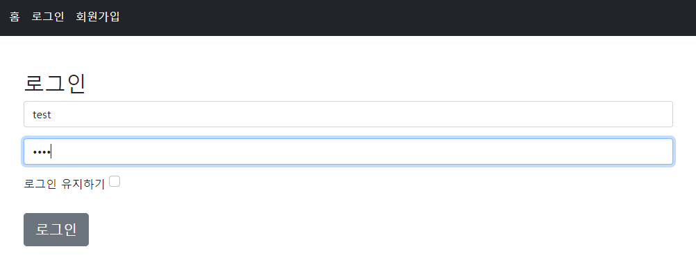

로그인 페이지 입니다.   
아이디와 비밀번호를 입력 후, 로그인 버튼을 누르면    
메인 페이지로 redirect 됩니다.

로그인 유지하기 버튼을 누르면   
세션이 만료되기 전까지 로그인이 유지 됩니다.

# user page
## user note page

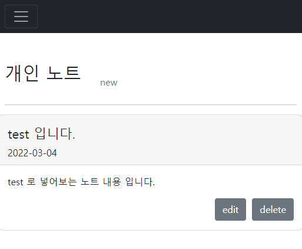

유저가 노트를 작성할 수 있는 페이지 입니다.

개인 노트를 작성할 수 있습니다.   
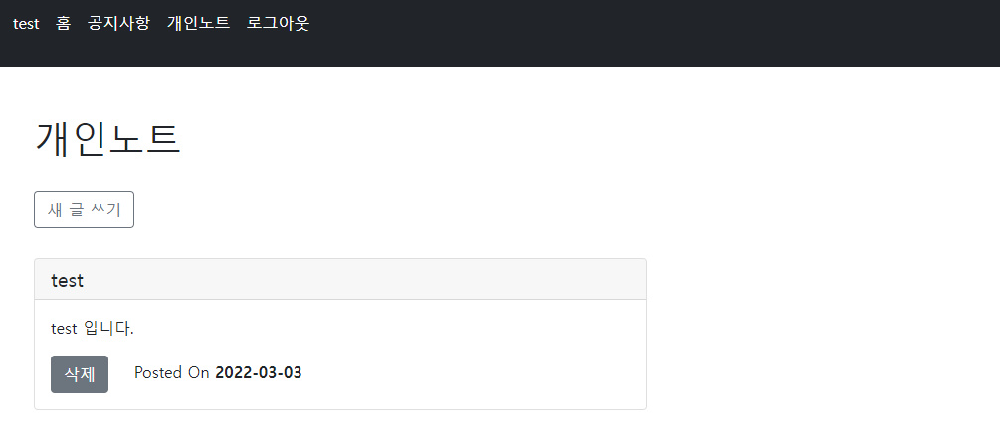

새 글쓰기 버튼을 누르면 alert 창이 뜹니다.   

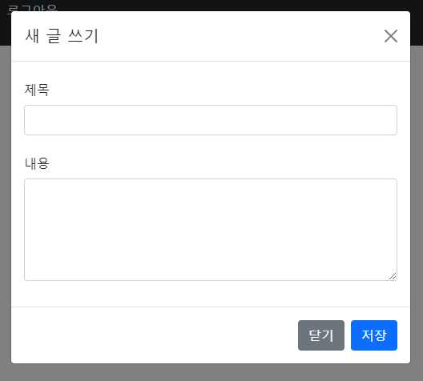

## user notice page

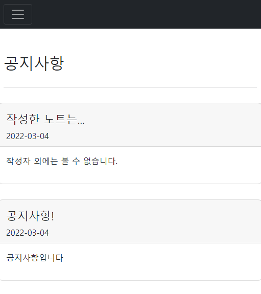

유저가 볼 수 있는 공지 페이지 입니다.
관리자가 작성한 공지를 확인할 수 있습니다.

# admin page

## admin note page

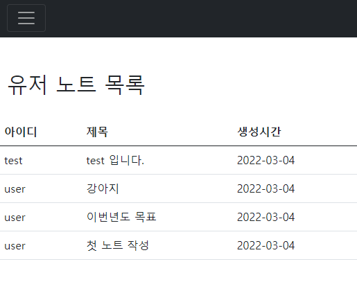

관리자의 노트 페이지 입니다.   
관리자는 인증 단계를 거친 모든 유저들의 노트 목록을 볼 수 있습니다.

## admin notice page

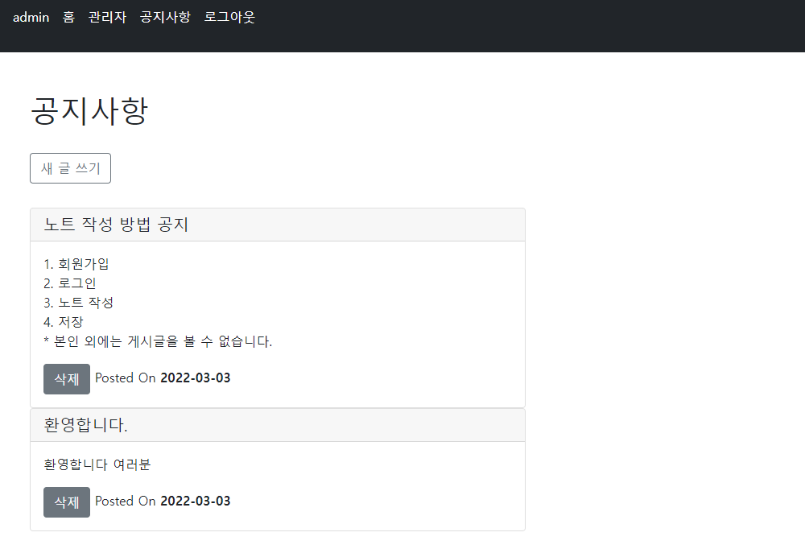
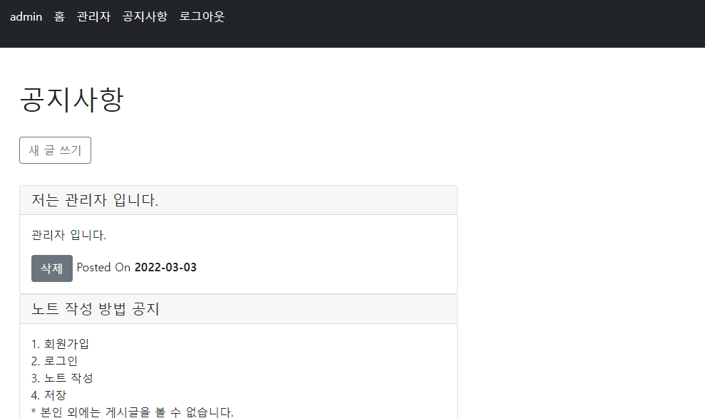

관리자가 볼 수 있는 공지 페이지 입니다.   
관리자만이 새 공지글 작성을 할 수 있습니다.   
